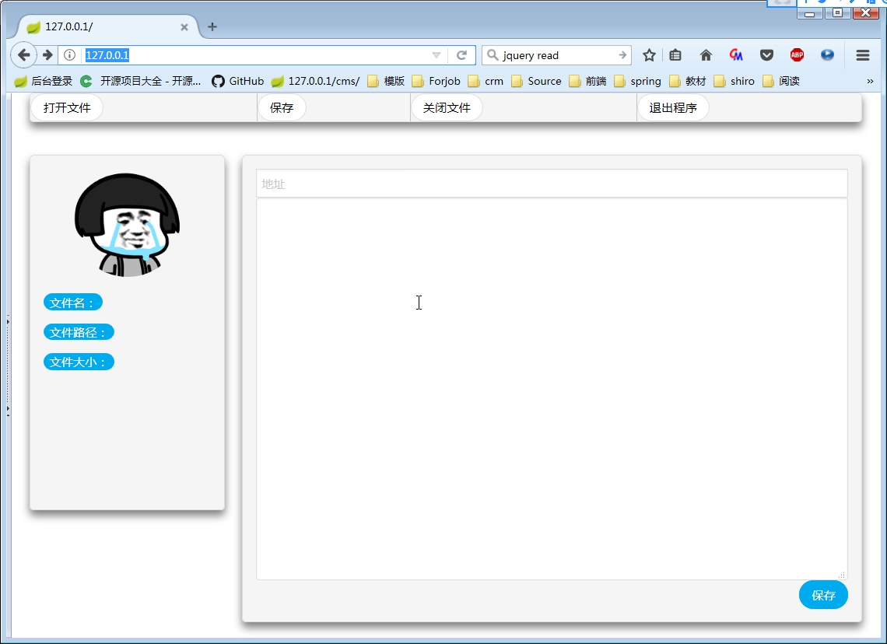
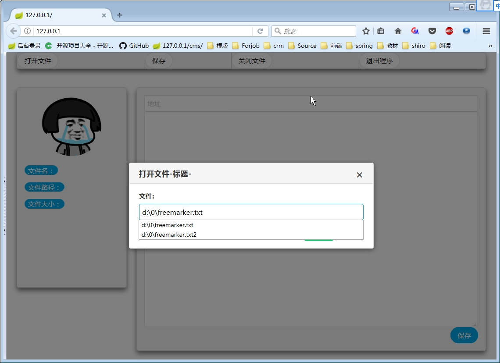
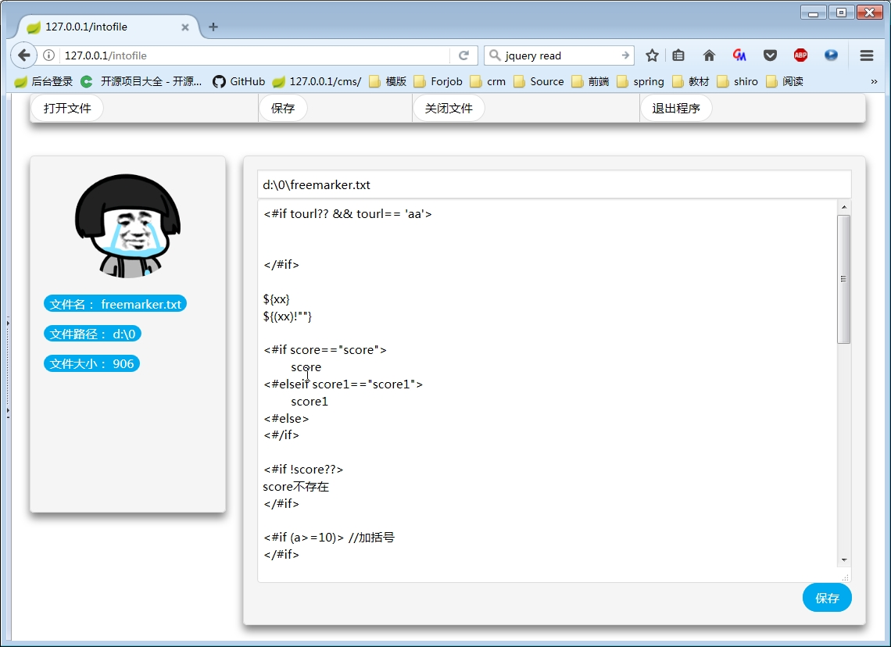
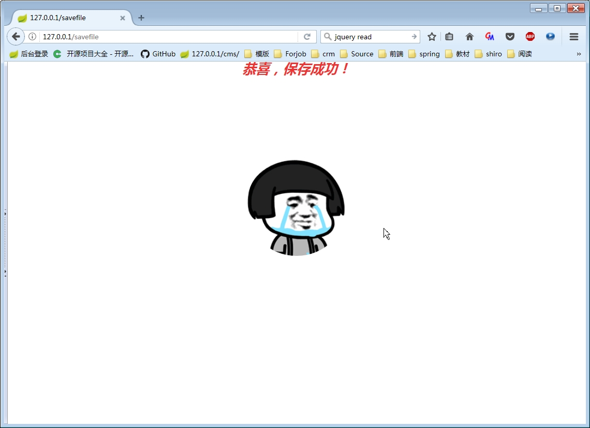

## 应用名称
WebNotepadproject

## 技术栈
	JDK8
	Spring-Boot
	JQuery
	Fastjson
	拼图Pintuer（非常优秀的响应式前端框架）

## 简要介绍
本应用类似于远程版的vi编辑器，不同于vi只能编辑本地文件，本应用既可以像vi编辑本地文件，也可以让对方通过远程轻松编辑本机的本地文件。(因为是web应用，所以有着web应用的特性)

## 快速开始
* 本程序为maven项目，所以首先需要下载和配置好maven。http://maven.apache.org/download.cgi
* 返回本程序项目主页点击右上角按钮进行下载
* 解压项目
* 使用命令 mvn clean package构建项目
* 构建完成后一般在target\目录下会得到一个jar包，运行该jar包即可

## 部分截图

